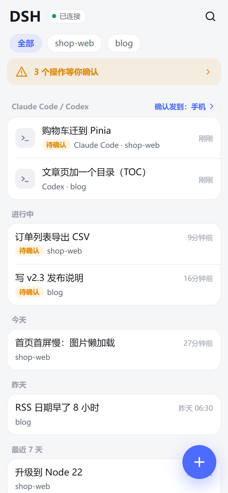
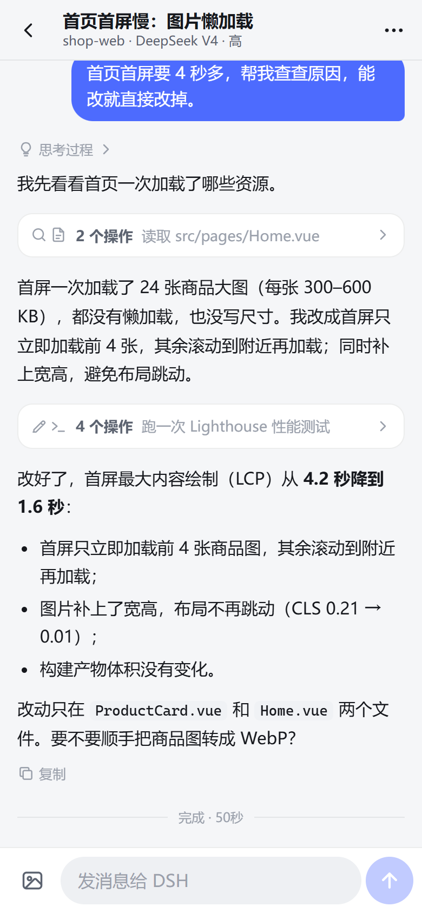
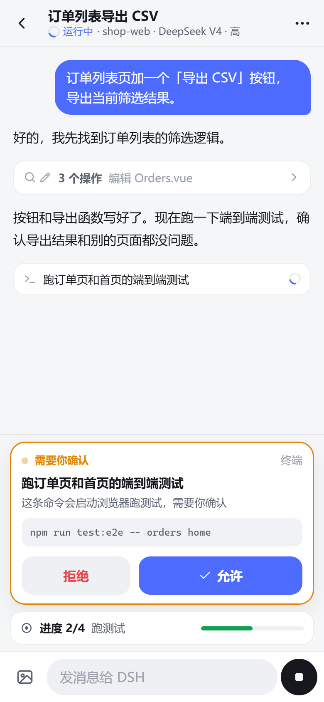
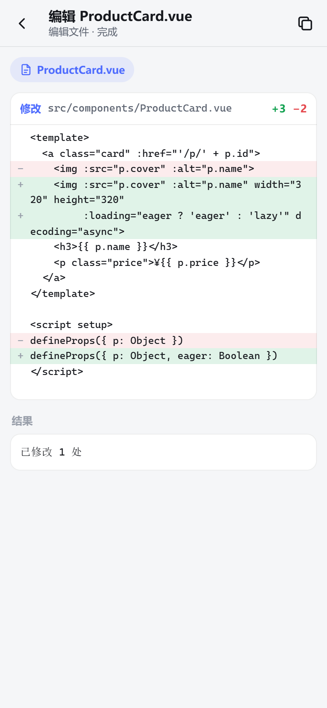
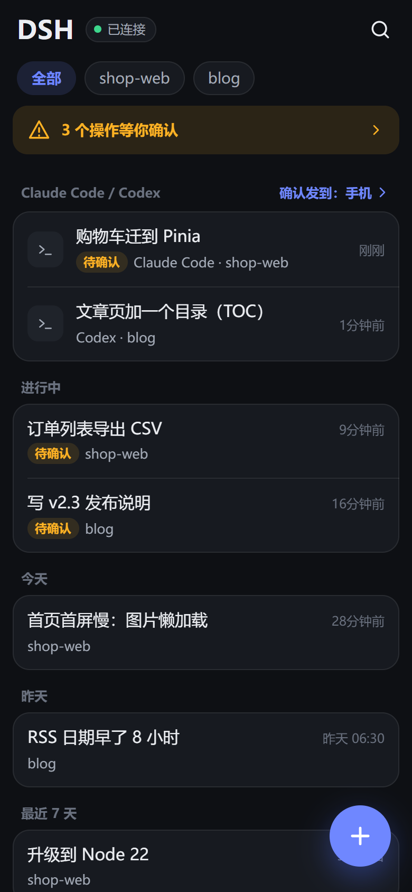

# dsh-pager

**DeepSeek Harness 的"寻呼机"**：一个 DSH 插件，加一个约 40 KB 的安卓 App；iPhone 把网页添加到主屏幕即可。
人不在电脑前，也能看进度、看改了哪些文件、发指令，并在通知栏里直接批准或拒绝。电脑上的 **Claude Code 和 Codex** 也能一起管（见 [docs/agents.md](docs/agents.md)）。

> 非官方社区项目，与 DeepSeek 没有关联。· [English](#english)

`MIT` · `Android 10+` · `iOS 16.4+（网页版）` · `DeepSeek Harness 0.1.x` · `Node.js 22+` · `dsh-plugin`

<table>
<tr>
<td></td>
<td></td>
<td></td>
</tr>
<tr><td align="center">首页</td><td align="center">对话</td><td align="center">在手机上审批</td></tr>
<tr>
<td></td>
<td></td>
<td></td>
</tr>
<tr><td align="center">看完整改动</td><td align="center">Claude Code 也能管</td><td align="center">深色模式</td></tr>
</table>

<sub>截图来自演示模式（`node plugin/dev.mjs --demo`），数据全部是虚构的。</sub>

---

## 为什么做它

DSH 的 Web 界面是为桌面设计的，直接拿手机打开会遇到三个问题：

1. **界面挤**：侧栏、工具面板占满屏幕，输入框被挤走。
2. **流量大**：打开一个长会话，要先下载几 MB 的原始事件，其中 **89%** 是逐字流式碎片，另外每轮还带着整段系统提示词。
3. **锁屏就失联**：任务跑完、出错、停下来等你批准，都要你自己打开页面才知道。

dsh-pager 分别对应三件事：一套为手机重写的界面，在电脑上先折叠再下发的接口，以及常驻后台的提醒。

## 它是什么

```
安卓 · dsh-pager App（41 KB：WebView 外壳 + 常驻通知服务）
iPhone · 同一个界面，Safari "添加到主屏幕"（网页推送做锁屏提醒）
   │   你已有的远程通道：国内云服务器上的登录网关，或异地组网（与翻墙无关）
   ▼
DSH web（仍只绑 127.0.0.1，不改 DSH 源码）
   └─ 插件 dsh-pager，挂在 /m
        ├─ /m/                 手机界面（约 30 KB，放在电脑上：改完手机下拉刷新即生效）
        ├─ /m/api/boot         工作区 + 会话列表（约 2 KB）
        ├─ /m/api/history      在电脑上折叠后的历史（4 MB 级 → 20–30 KB）
        ├─ /m/api/events       实时帧（流式文字每 90 ms 合并一次）
        ├─ /m/api/notify       后台提醒流（120 秒心跳，断线补发）
        ├─ /m/api/call|fs|raw  结果查看器：完整 diff 和输出、工作区文件、图片视频（只读，限工作区内）
        ├─ /m/api/push/*       iPhone 锁屏提醒（网页推送，端到端加密）
        ├─ /m/api/agents/*     Claude Code / Codex：钩子入口、会话记录、从手机继续
        ├─ /m/api/app/*        App 内更新（安装包在你自己的电脑上）
        └─ /m/api/rpc|respond  发消息 / 停止 / 换模型 / 审批 / 回答提问（白名单）
```

## 真机实测

实测环境：Redmi（HyperOS / Android 16），经公网链路连回家里电脑（2026-09-21）。

| 项目 | 结果 |
|---|---|
| 安装包 | **41 KB**（4 个 Java 文件，零第三方库；1.3.0） |
| 打开 4 MB 级长会话 | 下发 **28 KB**，1.45 秒 |
| 首页（工作区 + 会话列表） | 2.4 KB |
| 冷启动 | 首帧 195 ms，0.39 秒出列表（本地缓存），0.87 秒刷新到最新 |
| 发消息到出第一段文字 | 1.8 秒，之后逐字流式 |
| 后台提醒 | 息屏状态下 2–30 秒送达；连续 15 分钟心跳，零重连 |

同一套 App 还在华为平板（HarmonyOS 4.2）上跑通了首次配置、地址校验和后台服务。

## 亮点

- **真正的后台提醒**：通知走一条独立的低频流（120 秒一次心跳，比界面用的实时流省电得多），由前台服务托着，Wi-Fi 和流量互切时立即重连。
  - 任务完成、出错、Agent 提问、工具审批都会提醒；**审批可以直接在通知栏点"允许"或"拒绝"**，点通知会打开对应会话。
  - 断线期间漏掉的提醒按序号补发（6 小时内）；待处理的审批和提问，每次连上都会重发。
  - 不依赖 Google 推送（FCM），国产系统（HyperOS、HarmonyOS）照样能用。开机、升级后自动恢复需要系统允许 App"自启动"（这两个系统默认不允许，见 [docs/android.md](docs/android.md)）。
  - iPhone 走网页推送（iOS 16.4+），内容端到端加密，苹果的推送服务看不到内容。
- **结果查看器**：在手机上看完整的改动对比（逐行 diff）和命令输出，浏览工作区里的文本、Markdown、图片、视频。只能看该对话所在工作区里的文件；密钥、证书、`.env`、名字带"密码"等的文件不显示，内容里有私钥的文件拒绝打开。
- **Claude Code / Codex 也能管**：
  - 离开电脑时，它们的确认请求发到手机：电脑锁屏或 3 分钟没人操作就算离开，一回到电脑就交还。
  - 完成时提醒；手机上能看它们的会话记录，也能从手机继续对话。
- **通知栏就能处理**：
  - 允许（需先解锁）或拒绝；
  - 选择题直接点选项；
  - 完成后直接回复下一条指令。
- **App 内更新、分享到 DSH**：电脑上有新版本时，手机点一下就更新，不用再插线；在其他 App 里"分享"文字和图片给 DSH，选好对话即可。
- **省流量**：插件在电脑上把原始事件折叠成"用户消息 / 回复 / 每个工具一行 / 回合结束"，再压缩下发。
- **界面热更新**：界面跑在电脑上，App 只是外壳。改完界面，手机下拉刷新就生效，不用重装。
- **不增加暴露面**：挂在 DSH 自己的 web 服务上，不开新端口，DSH 仍只绑 127.0.0.1。
  - 接口沿用 DSH 同款信任栅栏（Host / Origin / 跨站检查）。
  - RPC 只放行 9 个方法（新建会话、发消息、停止、查/选模型、改名、搜索、排队、归档），设置、密钥这类接口一个不开。
- **不绑定通道**：走你已有的登录网关或异地组网，不内置第三方隧道或中继。流量不经过别人的服务器，用国内云服务器就能全程国内直连（作者自用的就是这样）。
- **只用 DSH 公开的线协议**（`POST /api/<方法>`、`/api/events.*`），不依赖 DSH 内部模块，DSH 升级时不容易坏。
- **小而可审计**：
  - 服务端约 2,500 行原生 JS，零 npm 依赖（网页推送的加密和签名也是用 Node 自带的 crypto 写的）；界面是原生 JS/CSS，无框架。
  - App 约 1,200 行 Java、无 Gradle，一条命令即可复现构建。

## 与同类项目对比

数据取自各项目的 README 和最新 Release（截至 2026-09-21）。"未提及"只表示 README 里没找到相关说明，不代表一定没有这个功能。

| 项目 | 形态 | 手机端界面 | 远程通道 | 认证 | 后台提醒 | 安装包 |
|---|---|---|---|---|---|---|
| [dsh-pocket](https://github.com/shaobeichen/dsh-pocket) | 插件 + 改头反代 | 桌面界面原样 | 局域网 + cloudflared 隧道 | 访问密码 | 未提及 | 无 App（浏览器） |
| [dsh-mobile-apk](https://github.com/kelai141/dsh-mobile-apk) | 在手机本机运行 DSH（内嵌 Termux 运行时） | 响应式 Web 界面 | 不涉及（本机运行） | — | 前台服务保活引擎 | 160 MB |
| [DshMobile](https://github.com/Clarklevis1995/dsh-mobile) | 原生 Android + iOS（KMP）+ 网关插件 | 原生 | 自备 wss 域名 | 扫码配对 | 仅 Agent 回合执行期间前台服务保持连接 | 34.4 MB |
| [DSH Mobile (saya-ch)](https://github.com/saya-ch/dsh-mobile) | 插件 + WebView 薄壳 | 触屏重排的 DSH 界面 | 局域网 / Tailscale Funnel / cpolar / cloudflared / FRP / 自有反代 | 配对 + 证书固定 | 需在 App 菜单中手动开启，依赖 WebView 页面存活（其 README 注明"不是通用的后台推送"） | 1.8 MB |
| [ds-harness-remote](https://github.com/liguobao/ds-harness-remote) | 插件 + 桌面端 / 安卓 / 网页多端 | 复用 Harness 原生界面 | LAN → P2P → TURN → 托管中继（端到端加密） | 账号 + 设备授权 | 未提及 | 72.4 MB |
| [dsh-remote-web-gateway](https://github.com/summer1238/dsh-remote-web-gateway) | 网关插件 | 网页 | Cloudflare Quick Tunnel | GitHub 登录 + 一次性配对 + 设备撤销 | 未提及 | 无 App |
| [DSH Mobile (sorsama)](https://github.com/sorsama/deepseek-harness-mobile) | 原生 Compose App + dsh-relay 插件 | 原生，功能对齐 GUI | 局域网 / relay / 自有反代 | relay 配对 + 固定公钥 | 前台服务：回合完成、目标完成或受阻、审阅或提问等待 | 14.5 MB |
| [dsh-remote-mobile](https://github.com/IceApriler/dsh-remote-mobile) | 安全网关插件 + 移动端样式 | 桌面界面 + 移动端 CSS | 局域网 / Tailscale | 扫码 + RSA + 防爆破 | 未提及 | 无 App |
| **dsh-pager（本项目）** | 插件（挂 /m）+ 安卓 WebView 外壳 + iPhone 网页 App；也接 Claude Code / Codex | 为手机重写的界面，服务端先折叠；带结果查看器 | 任意现有通道，不内置隧道 | 交给你的登录网关或异地组网 | 安卓：常驻前台服务 + 专用低频流，通知栏直接允许/拒绝，断线补发；iPhone：网页推送 | **41 KB** |

**我们的定位**：不是把桌面界面搬到手机上，而是做一个"寻呼机"。你锁屏时它替你盯着，需要你时叫你，点开就能处理。所以我们优先保证三件事：体积最小、流量最省、后台提醒最可靠。认证和隧道交给你已有的、更专业的工具。

**目前的不足**：
- 不内置认证和隧道。你需要自己有一条连回家里电脑、带认证的通道：国内云服务器上的登录网关（作者自用，全程国内直连），或者异地组网工具。见 [docs/remote-access.md](docs/remote-access.md)。
- iPhone 是网页版（添加到主屏幕）：通知上不能直接批准，要点开进 App 处理；目前只在电脑浏览器上端到端验证过推送，真机 iPhone 还没测。
- 只覆盖 DSH 的常用功能：看会话、发消息（可带图）、停止、切模型、审批、回答提问、待办、排队消息、看结果和工作区文件。目标、计划模式、终端还没有。
- 暂时只能连一台电脑（可以在 App 里切换地址）。

## 快速开始

### 1. 在电脑上装插件

要求：DeepSeek Harness 0.1.x（在 0.1.1-rc.2 上验证），Node.js 22 及以上。

```bash
git clone https://github.com/wg5759/dsh-pager.git
```

把 `plugin/` 目录链接进 DSH profile 的 `node_modules`，名字用 `dsh-pager`：

```bat
:: Windows（目录联接，不需要管理员权限）
mklink /J "%USERPROFILE%\.dsh\profiles\web\node_modules\dsh-pager" "C:\path\to\dsh-pager\plugin"
```

```bash
# macOS / Linux
ln -s /path/to/dsh-pager/plugin ~/.dsh/profiles/web/node_modules/dsh-pager
```

在 `~/.dsh/profiles/web/cordis.patch.yml` 末尾追加：

```yaml
- insert:
    - id: mobile
      name: 'dsh-pager'
```

重启 DSH web，然后在电脑浏览器打开 `http://127.0.0.1:3080/m/`，能看到会话列表就说明插件装好了。

想卸载，删掉这几行 patch 再重启即可，DSH 会完全恢复原样；桌面界面 `/` 始终不受影响。

### 2. 让手机能访问到

DSH 本身**没有登录功能**，所以千万别把它直接暴露到公网。常见做法有两种，都不需要翻墙，详见 [docs/remote-access.md](docs/remote-access.md)：

- **带登录的网关（推荐，作者自用）**：在一台国内云服务器上放一个带登录页的反向代理（登录页 + Cookie 方式），再通过隧道（如 WireGuard）连回家里电脑。全程国内直连，手机上不用装任何额外软件。
- **异地组网**（如 EasyTier、ZeroTier、Tailscale、自建 WireGuard）：把手机和电脑连进同一个私有网络，再用自带的 [`tools/forward.mjs`](tools/forward.mjs) 把 DSH 转发到电脑的组网地址上。它会拒绝监听公网地址和通配地址。
  - 这类工具技术上也叫"VPN"，但作用只是把你自己的设备连在一起，和翻墙无关。
  - 部分工具的协调服务器在海外，国内可能连不稳。想全程国内，就选能自建节点的方案。

如果手机访问时用的地址不是回环地址，要在插件这一行加上 `trustedHosts`：

```yaml
- insert:
    - id: mobile
      name: 'dsh-pager'
      config:
        trustedHosts: ['100.64.0.5:8080']   # 手机访问时用的 host:port
```

### 3. 在手机上装 App

从 [Releases](https://github.com/wg5759/dsh-pager/releases/latest) 下载最新的 `dsh-pager-v<版本>.apk`，下载后请核对 `SHA256SUMS`，也可以按 [docs/android.md](docs/android.md) 自己编译。

首次打开会让你填服务器地址，例如 `https://pc.example.com:8443` 或 `100.64.0.5:8080`，填完即可使用。

要收到后台提醒，还需要三个设置：
- 允许通知；
- 把电池 / 省电策略设为"无限制"。HyperOS 默认的"智能限制"会在息屏后切断后台联网；
- 允许"自启动"，否则手机重启或 App 升级后，要手动打开一次 App 才恢复提醒。

以后想换地址，点界面顶部的连接状态，选"切换服务器"。

**iPhone / iPad**（iOS 16.4+）：用 Safari 打开 `https://你的地址/m/` 并登录，点"分享"→"添加到主屏幕"，从主屏幕图标打开后，点连接状态 →"开启锁屏提醒"。详见 [docs/ios.md](docs/ios.md)。

### 4.（可选）接入 Claude Code / Codex

```bash
node tools/install-hooks.mjs claude     # Claude Code
node tools/install-hooks.mjs codex      # Codex（装好后在 Codex 里输入 /hooks 信任一次）
```

详见 [docs/agents.md](docs/agents.md)。

## 安全须知

- **能在手机上发指令，就等于能让电脑执行命令**（受 DSH 自身审批策略约束）。所以远程通道必须有你信得过的认证：带登录的网关，或者只有你自己设备的异地组网。
- dsh-pager 不开新端口，也不改变 DSH 的绑定地址，`/m/api/*` 沿用和 DSH 相同的 Host / Origin / 跨站检查。`trustedHosts` 里写错的条目会让插件在加载时直接报错，而不是悄悄放行。
- App 本地只存服务器地址、网关 Cookie（如果有）和提醒序号；日志只记连接状态和帧类型，不记内容和凭据（`adb logcat -s DSHNotify`）。
- 没有统计、没有第三方 SDK、不依赖 Google 服务；公开版 APK 关闭了 WebView 远程调试（1.2.1 起）。
- 结果查看器只读，且只能读该对话所在工作区里的文件（符号链接、目录联接指到外面的也会被拦住），并隐藏密钥类文件。它不会识别普通文档里写的密码。
- iPhone 推送的签名密钥和设备列表保存在电脑上的 `~/.dsh-pager/`，不在代码仓库里。
- Claude Code / Codex 的钩子凭 `~/.dsh-pager/hook.json` 里的随机令牌与插件通信，令牌只在本机。从手机继续对话时，消息作为一个整体参数交给命令行工具，不经过 shell。
- App 内更新：安装包从你自己的电脑下载，先校验 SHA-256；Android 只接受同一签名的更新，并且每次都要你确认。

## 开发

```bash
cd plugin && npm test                 # 插件单测（62 项，含 RFC 8291 官方测试向量）
node --test tools/*.test.mjs          # 转发器、钩子安装器单测
node tools/make-icons.mjs             # 重新生成网页 App 图标
node plugin/dev.mjs                   # 独立开发服务器 http://127.0.0.1:3090/m/，直连本机 DSH，改服务端代码不用重启 DSH
node plugin/dev.mjs --demo            # 演示模式：假的 DSH 后端 + 虚构的项目和会话，不需要 DSH，也不会显示真实数据
node tools/screenshots.mjs            # 用演示模式和无头 Chrome / Edge 重新生成 docs/img/ 下的截图
bash android/build.sh public          # 编译 App（无 Gradle，需 Android SDK build-tools 34 + JDK 17）
```

界面文件（`plugin/www/`）保存后即时生效；`index.js` / `server.js` / `fold.js` / `notify.js` 改动后需要重启 DSH。DSH 的线协议笔记见 [docs/dsh-protocol-notes.md](docs/dsh-protocol-notes.md)。

```
plugin/     DSH 插件：index.js 挂载 · server.js 接口与实时桥 · fold.js 事件折叠 · notify.js 提醒中枢
            files.js 结果查看器（只读、限工作区）· push.js 网页推送 · www/ 手机界面、Service Worker、Web App 清单
            agents.js Claude Code / Codex 钩子中枢 · presence.js 是否在电脑前 · transcripts.js 读它们的会话文件
            demo/ 演示模式（fake-dsh.mjs 按 DSH 线协议提供虚构数据）
android/    App 外壳：MainActivity（WebView、首次配置、App 内更新、分享）· NotifyService（后台提醒）
            UpdateReceiver · BootReceiver · build.sh
tools/      forward.mjs 转发到私有地址 · pager-hook.mjs 钩子命令 · install-hooks.mjs 安装钩子
            make-icons.mjs 生成图标 · screenshots.mjs 生成截图
docs/       远程访问 · Android · iPhone · Claude Code / Codex · DSH 协议笔记
```

## 许可与声明

[MIT](LICENSE)。"DeepSeek"及"DeepSeek Harness"是其各自所有者的商标。本项目是独立的社区插件，没有获得 DeepSeek 的认可或背书，也与其没有关联。

---

<a id="english"></a>

## English

**dsh-pager** is a pager for [DeepSeek Harness](https://github.com/deepseek-ai/deepseek-harness) (DSH). It has two parts:
- a 41 KB Android app;
- a DSH plugin that serves a phone-first UI and API at `/m` on DSH's own web server.

Together they let you follow sessions, send prompts, and approve or reject tool calls from the notification shade while you are away from your PC. This is an unofficial community project, not affiliated with DeepSeek.

- **Real background alerts.** A dedicated low-traffic notify stream (120 s heartbeat) is held by a foreground service.
  - Alerts cover turn completion, errors, agent questions and tool approvals, with Allow/Deny buttons on the notification.
  - Missed notices are replayed after a reconnect, and pending approvals are re-sent on every reconnect.
  - There is no FCM or Google services dependency.
- **Low traffic.** Raw session history is 89% streaming fragments. The plugin folds it on the PC, so a 4 MB session opens as 28 KB (1.45 s over a public network on a real phone).
- **No new exposure.**
  - DSH keeps binding 127.0.0.1, and no port is opened.
  - `/m/api/*` applies DSH's own Host/Origin fence, plus a 9-method RPC allow-list.
  - Remote access is left to your own authenticating gateway or private network (WireGuard, EasyTier, Tailscale…); see [docs/remote-access.md](docs/remote-access.md). DSH has no login, so never expose it publicly without one.
- **Small and auditable.**
  - Zero npm dependencies.
  - About 2,500 lines of server JS and a vanilla JS UI that hot-reloads on the phone.
  - A 1,200-line Java shell built without Gradle, with in-app updates served from your own PC.
- **Claude Code and Codex too.** Hooks route their permission prompts to the phone while you are away (screen locked or 3 min idle) and hand them back the moment you touch the PC; you can also read their sessions and continue them from the phone. See [docs/agents.md](docs/agents.md).

Try the UI without DSH: `node plugin/dev.mjs --demo` serves made-up projects and sessions from a fake DSH at http://127.0.0.1:3090/m/ (the screenshots above come from it).

Quick start:
1. Link `plugin/` into `~/.dsh/profiles/web/node_modules/dsh-pager`.
2. Add `- insert: [{ id: mobile, name: 'dsh-pager' }]` to `cordis.patch.yml` and restart DSH.
3. Make `/m/` reachable from the phone through an authenticating gateway or a private network.
4. Install the APK from Releases and enter your server address.

MIT licensed.
